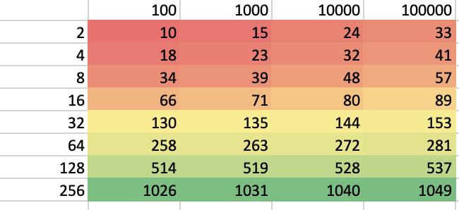
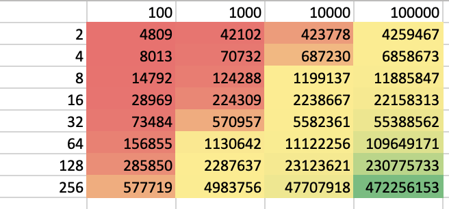
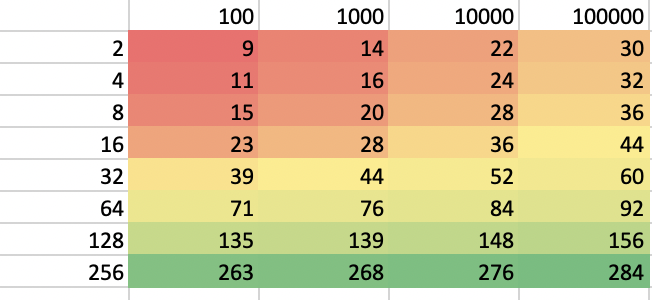
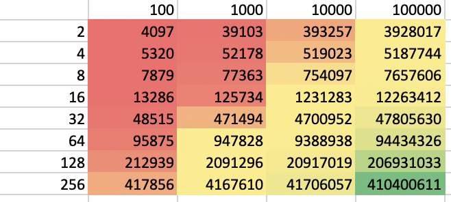
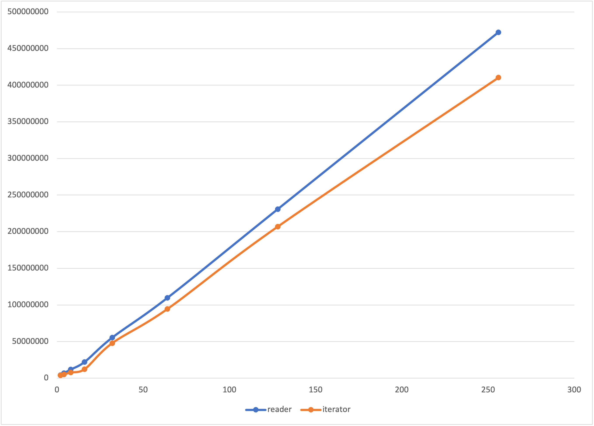

## 🌊 Go Benchmarks for Stream Processing

_Is it efficient to chain `io.Readers` in Go?_  
_How efficient it is compared to UNIX pipes?_  
_How efficient would be iterator?_  

## Tested Scenarios

`ReaderSelector`

This stream processor wraps `bufio.Scanner` and writes `[]byte` to destination. It can be convenient to wrap for `io.Reader` interface. It is efficient since `[]byte` is casted to `string`. However, since it copies memory to output, chaining many of similar readers can cause overhead due to each of processors does copying.

* `io.Reader` interface
* constant memory. memory does not increase with scaling input
* 600MB takes 40s
* user cpu time (7s) is faster than `grep` (26s)
* system cpu time (36s) is mush slower than `grep` (0.25s)
* chaining readers is constant memory
* chaining readers has linear processing time
* chaining readers in Go has faster user cpu time (7s) then via UNIX pipe (11.1 + 4.7 = 15.8s)

`IteratorSelector`

This steam processor wraps iterate calls. It performs reading and writing of bytes only once. Data is passed through function calls. Parsing and Printing is also minimized, since already parsed data structures are passed in chain of iterators. Data passed in iterator chain is either small enough to be on stack or pointers to same bytes buffer. This make it more efficient to chain many processors.

* uses wrappers for `io.Reader` interface
* constant memory
* 4x less mallocs than `io.Reader` version
* time is 10% faster tha `io.Reader` version
* time per processor composition is slightly cheaper

### Benchmarks UNIX Pipe

`grep`

```
time cat testdata/colors-basic-100000000.csv | grep -E 'red|green' | grep green > testdata/colors-basic-100000000.csv.out.grep
```

```
cat testdata/colors-basic-100000000.csv  0.01s user 0.14s system 0% cpu 26.462 total
grep --color=auto -E 'red|green'  26.10s user 0.25s system 99% cpu 26.463 total
grep --color=auto green > testdata/colors-basic-100000000.csv.out.grep  7.28s user 0.23s system 28% cpu 26.462 total
```

`ReaderSelector` through UNIX pipe

```
time cat testdata/colors-basic-100000000.csv | ./reader-selector -dict red,green | ./reader-selector -dict green > testdata/colors-basic-100000000.csv.out.reader-selector
```

```
cat testdata/colors-basic-100000000.csv  0.02s user 0.46s system 1% cpu 40.874 total
./reader-selector -dict red,green  11.15s user 7.63s system 45% cpu 40.876 total
./reader-selector -dict green >   4.57s user 35.89s system 98% cpu 40.886 total
```

`ReaderSelector` through Go wrapping

```
time cat testdata/colors-basic-100000000.csv | ./reader-selector-inline -dict1 red,green -dict2 green > testdata/colors-basic-100000000.csv.out.reader-selector-inline
```

```
cat testdata/colors-basic-100000000.csv  0.02s user 0.43s system 1% cpu 42.902 total
./reader-selector-inline -dict1 red,green -dict2 green >   7.67s user 34.88s system 99% cpu 42.906 total
```

### Benchmarks Go

```
goos: darwin
goarch: arm64
pkg: github.com/nikolaydubina/go-stream-benchmarks
BenchmarkReaderSelector/n=100-10    	  261753	      5158 ns/op	    9520 B/op	      14 allocs/op
BenchmarkReaderSelector/n=1000-10   	   28534	     41873 ns/op	   13872 B/op	      17 allocs/op
BenchmarkReaderSelector/n=10000-10  	    2881	    413503 ns/op	   93240 B/op	      26 allocs/op
BenchmarkReaderSelector/n=100000-10 	     288	   4194997 ns/op	  916545 B/op	      35 allocs/op
BenchmarkReaderSelector_Chain/l=2_n=100-10         	  233853	      4809 ns/op	    9104 B/op	      10 allocs/op
BenchmarkReaderSelector_Chain/l=2_n=1000-10        	   27447	     42102 ns/op	   20624 B/op	      15 allocs/op
BenchmarkReaderSelector_Chain/l=2_n=10000-10       	    2782	    423778 ns/op	  162456 B/op	      24 allocs/op
BenchmarkReaderSelector_Chain/l=2_n=100000-10      	     282	   4259467 ns/op	 1546913 B/op	      33 allocs/op
BenchmarkReaderSelector_Chain/l=4_n=100-10         	  138314	      8013 ns/op	   17664 B/op	      18 allocs/op
BenchmarkReaderSelector_Chain/l=4_n=1000-10        	   17065	     70732 ns/op	   29184 B/op	      23 allocs/op
BenchmarkReaderSelector_Chain/l=4_n=10000-10       	    1744	    687230 ns/op	  171016 B/op	      32 allocs/op
BenchmarkReaderSelector_Chain/l=4_n=100000-10      	     174	   6858673 ns/op	 1555472 B/op	      41 allocs/op
BenchmarkReaderSelector_Chain/l=8_n=100-10         	   71600	     14792 ns/op	   34784 B/op	      34 allocs/op
BenchmarkReaderSelector_Chain/l=8_n=1000-10        	    9890	    124288 ns/op	   46304 B/op	      39 allocs/op
BenchmarkReaderSelector_Chain/l=8_n=10000-10       	     998	   1199137 ns/op	  188136 B/op	      48 allocs/op
BenchmarkReaderSelector_Chain/l=8_n=100000-10      	      99	  11885847 ns/op	 1572594 B/op	      57 allocs/op
BenchmarkReaderSelector_Chain/l=16_n=100-10        	   34550	     28969 ns/op	   69024 B/op	      66 allocs/op
BenchmarkReaderSelector_Chain/l=16_n=1000-10       	    5290	    224309 ns/op	   80544 B/op	      71 allocs/op
BenchmarkReaderSelector_Chain/l=16_n=10000-10      	     535	   2238667 ns/op	  222377 B/op	      80 allocs/op
BenchmarkReaderSelector_Chain/l=16_n=100000-10     	      52	  22158313 ns/op	 1606832 B/op	      89 allocs/op
BenchmarkReaderSelector_Chain/l=32_n=100-10        	   18247	     73484 ns/op	  137504 B/op	     130 allocs/op
BenchmarkReaderSelector_Chain/l=32_n=1000-10       	    2126	    570957 ns/op	  149024 B/op	     135 allocs/op
BenchmarkReaderSelector_Chain/l=32_n=10000-10      	     217	   5582361 ns/op	  290857 B/op	     144 allocs/op
BenchmarkReaderSelector_Chain/l=32_n=100000-10     	      20	  55388562 ns/op	 1675312 B/op	     153 allocs/op
BenchmarkReaderSelector_Chain/l=64_n=100-10        	    8691	    156855 ns/op	  274464 B/op	     258 allocs/op
BenchmarkReaderSelector_Chain/l=64_n=1000-10       	    1052	   1130642 ns/op	  285984 B/op	     263 allocs/op
BenchmarkReaderSelector_Chain/l=64_n=10000-10      	     100	  11122256 ns/op	  427818 B/op	     272 allocs/op
BenchmarkReaderSelector_Chain/l=64_n=100000-10     	      10	 109649171 ns/op	 1812272 B/op	     281 allocs/op
BenchmarkReaderSelector_Chain/l=128_n=100-10       	    3831	    285850 ns/op	  548387 B/op	     514 allocs/op
BenchmarkReaderSelector_Chain/l=128_n=1000-10      	     502	   2287637 ns/op	  559908 B/op	     519 allocs/op
BenchmarkReaderSelector_Chain/l=128_n=10000-10     	      51	  23123621 ns/op	  701739 B/op	     528 allocs/op
BenchmarkReaderSelector_Chain/l=128_n=100000-10    	       5	 230775733 ns/op	 2086192 B/op	     537 allocs/op
BenchmarkReaderSelector_Chain/l=256_n=100-10       	    2095	    577719 ns/op	 1096227 B/op	    1026 allocs/op
BenchmarkReaderSelector_Chain/l=256_n=1000-10      	     252	   4983756 ns/op	 1107749 B/op	    1031 allocs/op
BenchmarkReaderSelector_Chain/l=256_n=10000-10     	      25	  47707918 ns/op	 1249580 B/op	    1040 allocs/op
BenchmarkReaderSelector_Chain/l=256_n=100000-10    	       3	 472256153 ns/op	 2634032 B/op	    1049 allocs/op
BenchmarkIteratorSelector/n=100-10    	  297792	      4265 ns/op	    5400 B/op	      13 allocs/op
BenchmarkIteratorSelector/n=1000-10   	   31400	     38182 ns/op	    9752 B/op	      16 allocs/op
BenchmarkIteratorSelector/n=10000-10  	    3134	    380777 ns/op	   89112 B/op	      24 allocs/op
BenchmarkIteratorSelector/n=100000-10 	     310	   3827292 ns/op	  912410 B/op	      32 allocs/op
BenchmarkIteratorSelector_Chain/l=2_n=100-10         	  286718	      4097 ns/op	    4984 B/op	       9 allocs/op
BenchmarkIteratorSelector_Chain/l=2_n=1000-10        	   29946	     39103 ns/op	   16504 B/op	      14 allocs/op
BenchmarkIteratorSelector_Chain/l=2_n=10000-10       	    3056	    393257 ns/op	  158328 B/op	      22 allocs/op
BenchmarkIteratorSelector_Chain/l=2_n=100000-10      	     304	   3928017 ns/op	 1542780 B/op	      30 allocs/op
BenchmarkIteratorSelector_Chain/l=4_n=100-10         	  206868	      5320 ns/op	    5032 B/op	      11 allocs/op
BenchmarkIteratorSelector_Chain/l=4_n=1000-10        	   22987	     52178 ns/op	   16552 B/op	      16 allocs/op
BenchmarkIteratorSelector_Chain/l=4_n=10000-10       	    2305	    519023 ns/op	  158376 B/op	      24 allocs/op
BenchmarkIteratorSelector_Chain/l=4_n=100000-10      	     230	   5187744 ns/op	 1542824 B/op	      32 allocs/op
BenchmarkIteratorSelector_Chain/l=8_n=100-10         	  143556	      7879 ns/op	    5128 B/op	      15 allocs/op
BenchmarkIteratorSelector_Chain/l=8_n=1000-10        	   15661	     77363 ns/op	   16648 B/op	      20 allocs/op
BenchmarkIteratorSelector_Chain/l=8_n=10000-10       	    1584	    754097 ns/op	  158472 B/op	      28 allocs/op
BenchmarkIteratorSelector_Chain/l=8_n=100000-10      	     158	   7657606 ns/op	 1542922 B/op	      36 allocs/op
BenchmarkIteratorSelector_Chain/l=16_n=100-10        	   94784	     13286 ns/op	    5320 B/op	      23 allocs/op
BenchmarkIteratorSelector_Chain/l=16_n=1000-10       	    9658	    125734 ns/op	   16840 B/op	      28 allocs/op
BenchmarkIteratorSelector_Chain/l=16_n=10000-10      	     943	   1231283 ns/op	  158664 B/op	      36 allocs/op
BenchmarkIteratorSelector_Chain/l=16_n=100000-10     	      94	  12263412 ns/op	 1543118 B/op	      44 allocs/op
BenchmarkIteratorSelector_Chain/l=32_n=100-10        	   25926	     48515 ns/op	    5704 B/op	      39 allocs/op
BenchmarkIteratorSelector_Chain/l=32_n=1000-10       	    2548	    471494 ns/op	   17224 B/op	      44 allocs/op
BenchmarkIteratorSelector_Chain/l=32_n=10000-10      	     254	   4700952 ns/op	  159049 B/op	      52 allocs/op
BenchmarkIteratorSelector_Chain/l=32_n=100000-10     	      25	  47805630 ns/op	 1543507 B/op	      60 allocs/op
BenchmarkIteratorSelector_Chain/l=64_n=100-10        	   12015	     95875 ns/op	    6472 B/op	      71 allocs/op
BenchmarkIteratorSelector_Chain/l=64_n=1000-10       	    1266	    947828 ns/op	   17992 B/op	      76 allocs/op
BenchmarkIteratorSelector_Chain/l=64_n=10000-10      	     128	   9388938 ns/op	  159816 B/op	      84 allocs/op
BenchmarkIteratorSelector_Chain/l=64_n=100000-10     	      12	  94434326 ns/op	 1544272 B/op	      92 allocs/op
BenchmarkIteratorSelector_Chain/l=128_n=100-10       	    5496	    212939 ns/op	    8008 B/op	     135 allocs/op
BenchmarkIteratorSelector_Chain/l=128_n=1000-10      	     566	   2091296 ns/op	   15432 B/op	     139 allocs/op
BenchmarkIteratorSelector_Chain/l=128_n=10000-10     	      56	  20917019 ns/op	  161352 B/op	     148 allocs/op
BenchmarkIteratorSelector_Chain/l=128_n=100000-10    	       5	 206931033 ns/op	 1545838 B/op	     156 allocs/op
BenchmarkIteratorSelector_Chain/l=256_n=100-10       	    2790	    417856 ns/op	   11080 B/op	     263 allocs/op
BenchmarkIteratorSelector_Chain/l=256_n=1000-10      	     295	   4167610 ns/op	   22600 B/op	     268 allocs/op
BenchmarkIteratorSelector_Chain/l=256_n=10000-10     	      27	  41706057 ns/op	  164424 B/op	     276 allocs/op
BenchmarkIteratorSelector_Chain/l=256_n=100000-10    	       3	 410400611 ns/op	 1548872 B/op	     284 allocs/op
```

ReaderSelector-Chain-memory


ReaderSelector-Chain-time


IteratorSelector-Chain-memory


IteratorSelector-Chain-time


Time of reader and iterator for n=100000 and l=256

